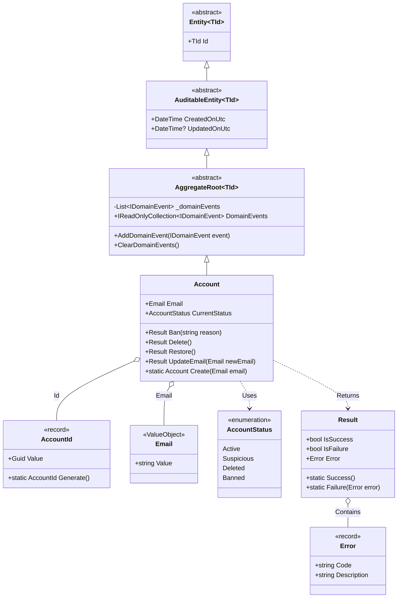

# Диаграмма классов доменной области

```mermaid
classDiagram
    class Entity~TId~ {
        <<abstract>>
        +TId Id
    }

    class AuditableEntity~TId~ {
        <<abstract>>
        +DateTime CreatedOnUtc
        +DateTime? UpdatedOnUtc
    }

    class AggregateRoot~TId~ {
        <<abstract>>
        -List~IDomainEvent~ _domainEvents
        +IReadOnlyCollection~IDomainEvent~ DomainEvents
        +AddDomainEvent(IDomainEvent event)
        +ClearDomainEvents()
    }

    class Account {
        +Email Email
        +AccountStatus CurrentStatus
        +Result Ban(string reason)
        +Result Delete()
        +Result Restore()
        +Result UpdateEmail(Email newEmail)
        +static Account Create(Email email)
    }

    class AccountId {
        <<record>>
        +Guid Value
        +static AccountId Generate()
    }

    class Email {
        <<ValueObject>>
        +string Value
    }

    class AccountStatus {
        <<enumeration>>
        Active
        Suspicious
        Deleted
        Banned
    }

    class Result {
        +bool IsSuccess
        +bool IsFailure
        +Error Error
        +static Success()
        +static Failure(Error error)
    }

    class Error {
        <<record>>
        +string Code
        +string Description
    }

    Entity <|-- AuditableEntity
    AuditableEntity <|-- AggregateRoot
    AggregateRoot <|-- Account
    Account o-- AccountId : Id
    Account o-- Email : Email
    Account ..> AccountStatus : Uses
    Account ..> Result : Returns
    Result o-- Error : Contains
```
